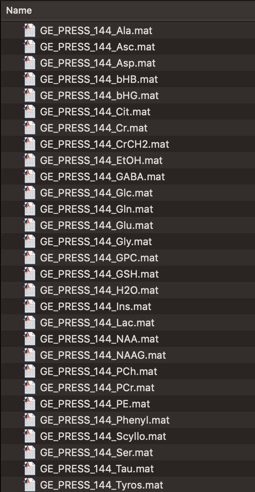
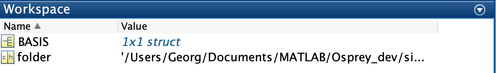
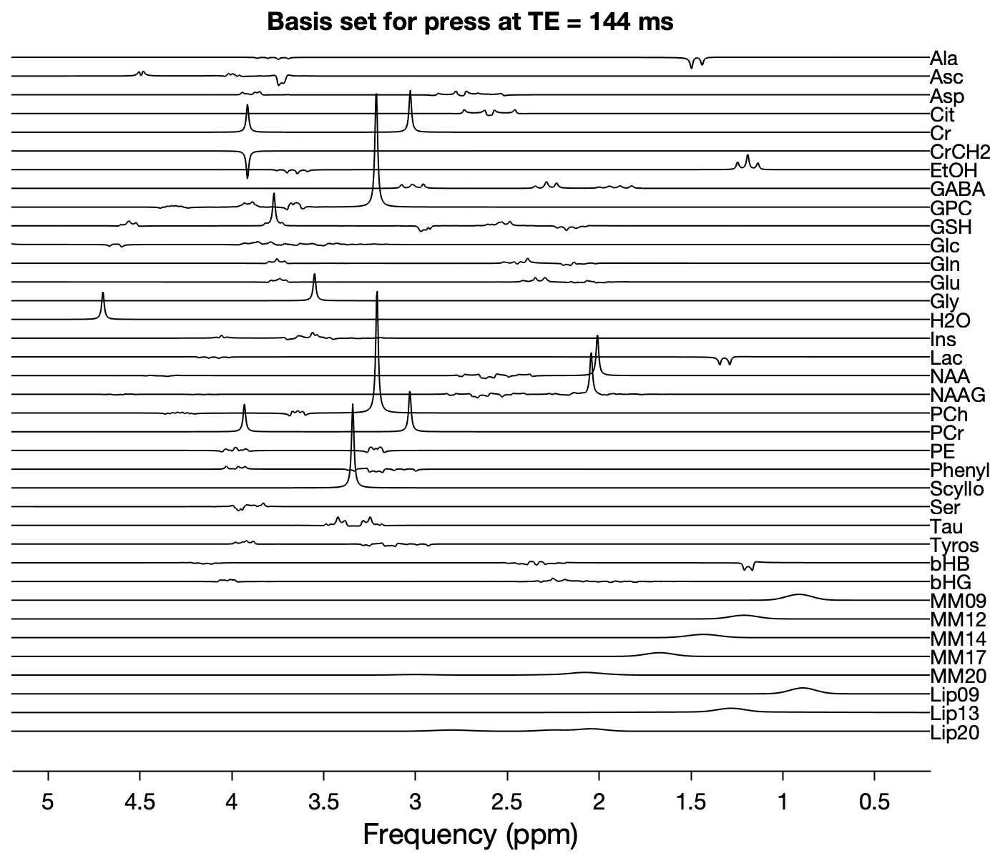

Osprey basis set tools
======================

Being a linear-combination modelling software, **Osprey** requires prior
spectral knowledge in the form of so-called *basis sets*. These are
collections of model spectra (*basis functions*) for the various
metabolites you wish to quantify.

Historically, basis functions were acquired experimentally from aqueous
solutions, which was a laborious and often incredibly frustrating task.
Fortunately, many free software solutions open up a world of simulating
any NMR experiment, and can generate noise-free model spectra of most of
the spin systems we could be interested in.

In this chapter, you will learn how to generate an **Osprey** basis set.
You can either import an existing complete basis set in LCModel format
(``.BASIS``), or you can compile an **Osprey** basis set from a set of
synthetic spectra that have been simulated using the `FID-A
software <https://github.com/CIC-methods/FID-A>`__. Please refer to the
example scripts in the repository for directions and how to do this. You
can also ask for advice in the `Spectral
Simulation <https://forum.mrshub.org/c/analysis-modeling/spectral-simulation/22>`__
and `Basis
Sets <https://forum.mrshub.org/c/analysis-modeling/basis-sets/23>`__
categories of the `MRSHub forum <https://forum.mrshub.org>`__.

.. note::

   It is now also possible to simulate basis sets for **Osprey** using a
   cloud-based simulation platform,
   `MRSCloud <https://braingps.mricloud.org/>`__. For further
   information, please refer to the full
   `publication <https://doi.org/10.1002/mrm.29370>`__, or the source
   code available on `Github <https://github.com/shui5/MRSCloud>`__.

io_LCMBasis
-----------

If you have an existing LCModel basis set (``.BASIS``), you can import
it into **Osprey**. Assuming the basis set is located at
``/Users/Georg/LCModelBasissets/GE/press144``, you can execute the
following command at the MATLAB prompt after you have run ``OspreyJob``:

> file = '/Users/Georg/LCModelBasissets/GE/press144';

You can then call **Osprey**\ ’s ``io_LCMBasis`` function to create a
basis set:

> [BASIS] = io_LCMBasis(file, 1, 'unedited', 'none');

Follow the instructions in the MATLAB prompt, and from then on,
OspreyFit will automatically pick this basis set, but only if there is
no internal existing **Osprey** basis set with matching parameters. We
will soon provide the option to specify an individual basis set in the
job file.

fit_makeBasis
-------------

For the purpose of this tutorial, we will assume that you have a set of
FID-A simulations saved in a folder on your hard drive. Your folder may
look like this:

   A folder full of FID-A simulations.

In this case, we have simulated a bunch of metabolites for the GE PRESS
sequence at an echo time of 144 ms.

If this folder is located at, say,
``/Users/Georg/MRS_Simulations/GE/press144``, you can create a variable
called ``folder`` at the MATLAB prompt:

> folder = '/Users/Georg/MRS_Simulations/GE/press144';

You can then call **Osprey**\ ’s ``fit_makeBasis`` function to create a
basis set:

> [BASIS] = fit_makeBasis(folder, 1, 'unedited');

This will generate a struct array called ``BASIS`` in the MATLAB
workspace, and also save it to the current MATLAB working directory.
This file is your new **Osprey** basis set. If the ``addMMFlag``
argument (see below) is set to ``1``, the filename of the basis set is
going to be ``BASIS_MM.mat``; if it is set to ``0``, the filename will
be ``BASIS_noMM.mat``.

Complete syntax
~~~~~~~~~~~~~~~

> [BASIS] = fit_makeBasis(folder, addMMFlag, sequence, editTarget);

Inputs
^^^^^^

+-------+-------+---------------------+-----------------+-------------+
| Input | Type  | Description         | Mandatory?      | Options     |
+=======+=======+=====================+=================+=============+
| f     | S     | Complete path to    | Yes             | —           |
| older | tring | the folder          |                 |             |
|       |       | containing ``.MAT`` |                 |             |
|       |       | files with          |                 |             |
|       |       | FID-A-simulated     |                 |             |
|       |       | metabolite basis    |                 |             |
|       |       | functions           |                 |             |
+-------+-------+---------------------+-----------------+-------------+
| addM  | Bo    | If set to ``1``     | No              | ``1``       |
| MFlag | olean | (default), Osprey   |                 | (default),  |
|       |       | will automatically  |                 | ``0``       |
|       |       | add macromolecule   |                 |             |
|       |       | and lipid basis     |                 |             |
|       |       | functions to the    |                 |             |
|       |       | basis set           |                 |             |
+-------+-------+---------------------+-----------------+-------------+
| seq   | S     | Determines the type | No              | ``'         |
| uence | tring | of sequence that    |                 | unedited'`` |
|       |       | you want to create  |                 | (default),  |
|       |       | a basis set for.    |                 | ``'MEGA'``, |
|       |       | Will try to         |                 | ``          |
|       |       | automatically       |                 | 'HERMES'``, |
|       |       | determine the order |                 | ``'         |
|       |       | of editing steps    |                 | HERCULES'`` |
|       |       | from saturated NAA  |                 |             |
|       |       | and water signals.  |                 |             |
+-------+-------+---------------------+-----------------+-------------+
| editT | S     | Determines the      | No              | ``'GABA'``  |
| arget | tring | target molecule(s)  |                 | (default),  |
|       |       | of the editing      |                 | ``'GSH'``   |
|       |       | experiment. Only    |                 |             |
|       |       | needs to be set if  |                 |             |
|       |       | ``sequence`` is set |                 |             |
|       |       | to something other  |                 |             |
|       |       | than                |                 |             |
|       |       | ``'unedited'``.     |                 |             |
+-------+-------+---------------------+-----------------+-------------+

Outputs
^^^^^^^

+-------+-------+---------------------+-----------------+-------------+
| O     | Type  | Description         | Mandatory?      | Options     |
| utput |       |                     |                 |             |
+=======+=======+=====================+=================+=============+
| BASIS | S     | Structure           | Yes             | —           |
|       | truct | containing the      |                 |             |
|       |       | **Osprey** basis    |                 |             |
|       |       | set.                |                 |             |
+-------+-------+---------------------+-----------------+-------------+

fit_plotBasis
-------------

Once you have generated the basis set, you may want to plot the basis
functions and inspect that they look like you expect them to. For this
purpose, **Osprey** includes a function called ``fit_plotBasis``.

``fit_plotBasis`` acts on the contents of an **Osprey** ``.MAT`` basis
set file. If you load any basis set into MATLAB by double-clicking on
it, you will see the struct ``BASIS`` in the MATLAB workspace:

   An Osprey basis set after loading into MATLAB.

You can then call ``fit_plotBasis`` to create a plot overview of the
basis set:

> fit_plotBasis(BASIS, 1, 1);

This command will generate a stack plot of all basis functions
(including macromolecules and lipids, if you have chosen to include them
in the basis set) along with a ppm axis:

   Output from fit_plotBasis.

.. _complete-syntax-1:

Complete syntax
~~~~~~~~~~~~~~~

> out = fit_plotBasis(basisSet, dim, stagFlag, ppmmin, ppmmax, xlab, ylab, figTitle);

.. _inputs-1:

Inputs
^^^^^^

+-------+-------+---------------------+-----------------+-------------+
| Input | Type  | Description         | Mandatory?      | Options     |
+=======+=======+=====================+=================+=============+
| bas   | S     | Name of the struct  | Yes             | —           |
| isSet | tring | in the MATLAB       |                 |             |
|       |       | workspace           |                 |             |
|       |       | containing the      |                 |             |
|       |       | Osprey basis set    |                 |             |
|       |       | (usually ``BASIS``) |                 |             |
+-------+-------+---------------------+-----------------+-------------+
| dim   | In    | Dimension of the    | No              | Default:    |
|       | teger | basis function that |                 | ``1``       |
|       |       | you want to plot.   |                 |             |
|       |       | For unedited data,  |                 |             |
|       |       | this will be ``1``. |                 |             |
|       |       | MEGA-edited data    |                 |             |
|       |       | will have the       |                 |             |
|       |       | ``off`` spectrum in |                 |             |
|       |       | dimension 1, the    |                 |             |
|       |       | ``on`` spectrum in  |                 |             |
|       |       | dimension 2, the    |                 |             |
|       |       | difference spectrum |                 |             |
|       |       | in dimension 3, and |                 |             |
|       |       | the sum spectrum in |                 |             |
|       |       | dimension 4.        |                 |             |
+-------+-------+---------------------+-----------------+-------------+
| sta   | Bo    | Determines whether  | No              | ``1`` =     |
| gFlag | olean | basis functions are |                 | staggered   |
|       |       | plotted vertically  |                 | (default),  |
|       |       | staggered or simply |                 | ``0`` (not  |
|       |       | on top of one       |                 | staggered)  |
|       |       | another.            |                 |             |
+-------+-------+---------------------+-----------------+-------------+
| p     | Float | Lower limit of ppm  | No              | Default:    |
| pmmin |       | axis to plot.       |                 | ``0.2``     |
+-------+-------+---------------------+-----------------+-------------+
| p     | Float | Upper limit of ppm  | No              | Default:    |
| pmmax |       | axis to plot.       |                 | ``5.2``     |
+-------+-------+---------------------+-----------------+-------------+
| xlab  | S     | X-axis label        | No              | Default:    |
|       | tring |                     |                 | ``'Frequen  |
|       |       |                     |                 | cy (ppm)'`` |
+-------+-------+---------------------+-----------------+-------------+
| ylab  | S     | Y-axis label        | No              | Default:    |
|       | tring |                     |                 | ``''``      |
+-------+-------+---------------------+-----------------+-------------+
| fig   | S     | Figure title        | No              | Default:    |
| Title | tring |                     |                 | ``''``      |
+-------+-------+---------------------+-----------------+-------------+

.. _outputs-1:

Outputs
^^^^^^^

+-------+-------+---------------------+-----------------+-------------+
| O     | Type  | Description         | Mandatory?      | Options     |
| utput |       |                     |                 |             |
+=======+=======+=====================+=================+=============+
| out   | F     | Figure handle for   | Yes             | —           |
|       | igure | the output figure   |                 |             |
|       | h     |                     |                 |             |
|       | andle |                     |                 |             |
+-------+-------+---------------------+-----------------+-------------+

